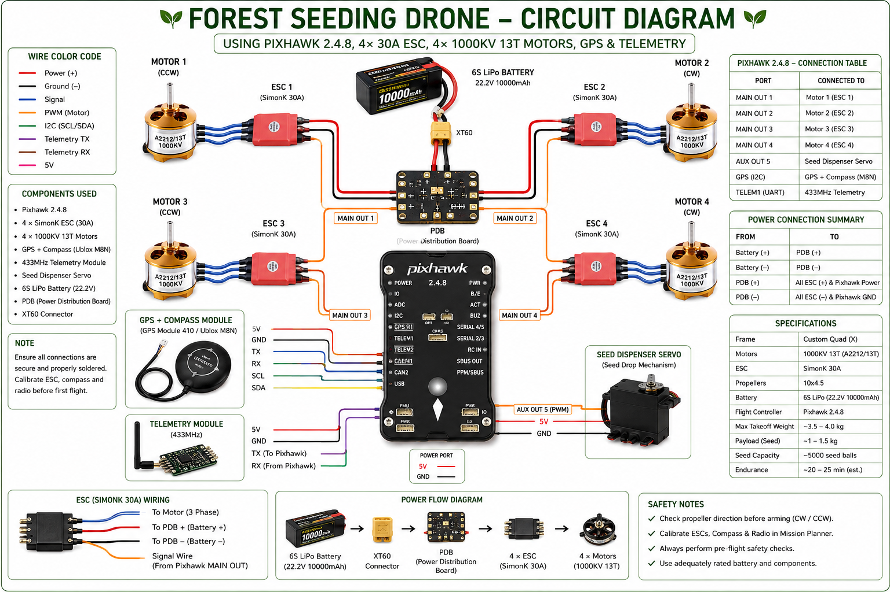

# 🌱🚁 Autonomous Forest Seeding Drone

## 📖 Project Overview
The Autonomous Forest Seeding Drone is an advanced drone-based environmental restoration system designed for automated seed plantation in forest and difficult terrain areas. The drone uses autonomous GPS navigation and a servo-controlled seed dropping mechanism to distribute seed pods efficiently.

This project focuses on combining drone technology, embedded systems, and automation for smart reforestation applications.

---

# ✨ Features
- 🚀 Autonomous waypoint navigation
- 📍 GPS-based flight control
- 🌱 Automated seed dropping mechanism
- 🛩️ Pixhawk flight controller integration
- 💻 Mission Planner support
- ⚡ Brushless motor propulsion system
- 🌍 Environmental and smart agriculture application
- 🪶 Lightweight drone frame design

---

# 🎯 Objectives
- 🌳 Reduce manual effort in forest plantation
- 📈 Improve seed distribution efficiency
- 🌱 Support reforestation using drone automation
- 🤖 Develop an intelligent environmental restoration system

---

# 🛠️ Components Used

## 🔩 Hardware Components
- 🛩️ Pixhawk Flight Controller
- 📡 GPS Module
- ⚡ Brushless DC Motors
- 🔌 Electronic Speed Controllers (ESC)
- 🔄 Servo Motor
- 🔋 LiPo Battery
- 🧩 Drone Frame
- 🍃 Propellers
- ⚙️ Power Distribution Board (PDB)
- 🌰 Seed Container Mechanism

---

# Hardware Circuit Diagram

This is the complete wiring diagram of the Forest Seeding Drone.

---

# 💻 Software & Tools
- 🖥️ Mission Planner
- 💡 Arduino IDE
- 👨‍💻 Embedded C
- 🔧 STM32 / Arduino Programming
- 📊 Drone Calibration Tools

---

# ⚙️ Working Principle
1. 📍 Mission area is selected using Mission Planner.
2. 🛰️ GPS waypoints are uploaded to the Pixhawk flight controller.
3. 🚁 The drone autonomously follows the predefined path.
4. 🌱 Servo mechanism releases seed pods at programmed intervals.
5. 🏁 Drone completes the mission and returns to launch position.

---

# 🌍 Applications
- 🌳 Forest restoration
- 🚜 Smart agriculture
- 🏔️ Seed plantation in difficult terrain
- 🌎 Environmental conservation
- 🚨 Disaster recovery plantation

---

# 🚀 Future Improvements
- 🤖 AI-based terrain mapping
- 🚧 Obstacle avoidance system
- 📷 Camera-based monitoring
- 📡 Real-time telemetry dashboard
- ☀️ Solar charging support
- 🔢 Automated seed counting system

---

# 🔬 Technologies Used
- 🤖 Embedded Systems
- 🦾 Robotics
- 🚁 Drone Electronics
- 📍 GPS Navigation
- ⚙️ Autonomous Systems
- 🔄 Servo Motor Control
- 🌍 Environmental Technology

---

# 👨‍💻 Author

## Shivam Mali
Electronics & Embedded Systems Student

### Interests
- 🤖 Robotics
- 🚁 Drones
- 💻 Embedded Systems
- 🔧 STM32 Development
- ⚙️ Automation
- 🧠 AI Integration

---

# 📜 License
This project is licensed under the MIT License.
